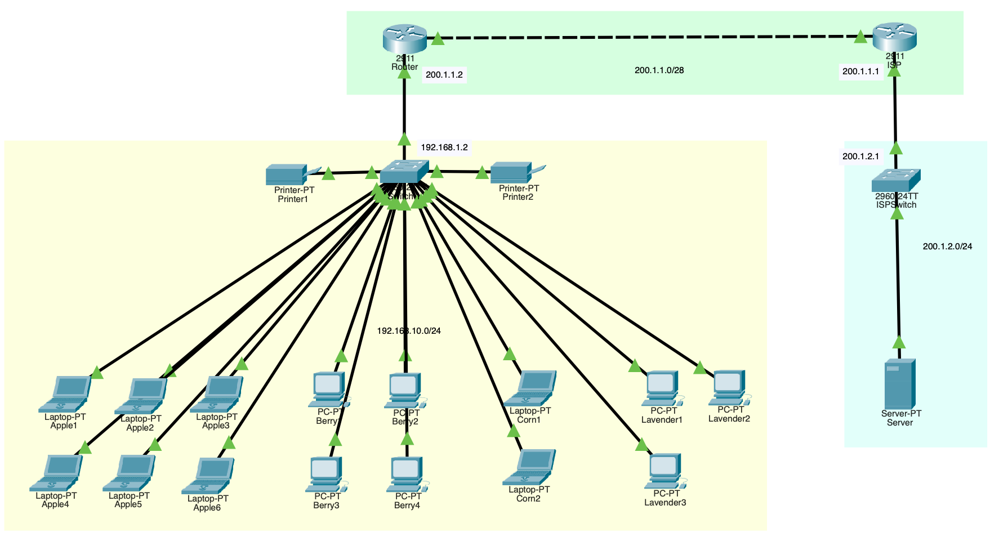

# Project 1 - Single LAN Office Setup

This will be the most basic project in this journey. The idea is to get myself familiar with the different network devices available and the troubleshooting steps by relying on the simulation of packet's movement among the network traffic.

The file: [Project_001 Packet Tracer file.](Project001.pkt)

### Topology

There are a total of 15 workstations, one switch on each side (internal and ISP) which are connected by router from each side on WAN connection.

#### IP Address

| Description  | Network         |
| ------------ | --------------- |
| Internal LAN | 192.168.10.0/24 |
| WAN Link     | 200.1.1.0/24    |
| ISP LAN      | 200.1.2.0/24    |

### Key Concepts Implemented

- [x] Flat network subnetting
- [x] Layer 2 switching (MAC learning)
- [x] ARP (IP -> MAC resolution)
- [x] Static routing, Default gateway
- [x] NAT (PAT Overload)
- [x] End-to-end connectivity (LAN- > WAN -> server)

### Steps

1. Insert necessary nodes/devices (2 routers, 2 switches, 2 printers, and 15 end users)
2. Add physical connection between devices
3. Choose the IP Range (as listed above)

| Description | IP/Prefix       | Gateway      |
| ----------- | --------------- | ------------ |
| Internal    | 192.168.10.0/24 | 192.168.10.1 |
| ISP         | 200.1.2.0/24    | 200.1.2.1    |
| WAN         | 200.1.1.0/24    | 200.1.1.1    |

4. Configure switch's hostname and the designated IP addresses and default gateway.
   - Switched uses VLAN 1 SVI for management IP.
   - Switching still uses MAC, not IP.
5. Configure router's hostname and IP address. Add local address to LAN facing and external address to WAN facing port.
   - Router connects two different network, enabling inter-network communication.
6. Rename end hosts and manually add its IP, DNS, and default gateway. Usually subnet mask is auto added, but can also adjust.
   - DNS for this projects is not required for IP-based testing, only for name resolution.
7. Check local traffic between internal devices
8. Configure PAT (NAT overload) on the internal router to translate private IPs into a single public IP.
9. Add ISP connection
   - Added second router to simulate ISP for full control of routing and return traffic
   - Ads switch and server (for internet connection check)
   - Assign WAN IP to the Router port that face the WAN. Assign internal ISP's IP to the switch.
   - For the server, update its IP address and ensure **http/https** service is on
10. Try reaching ISP server through LAN workstations or end devices by doing **< server-ip >/index.html** or even just the server-ip through browser on end devices

### Validation and Testing

- [x] PC -> PC communication (LAN)
- [x] PC -> Gateway reachability
- [x] NAT translation verified
- [x] PC -> ISP Server (HTTP access)

### Key learnings

- Learned how **PAT enables multiple private devices to share one public IP**
- Realized **DNS is required for name-based access, otherwise must use IP**
- Practiced troubleshooting using **packet flow and simulation tools**

### Common Issues Faced
- NAT configured but return traffic failed -> fixed dafault gateway
- Could ping but not browse -> missing DNS/wrong URL
- ISP simulation issues -> rpelaced modem with router
